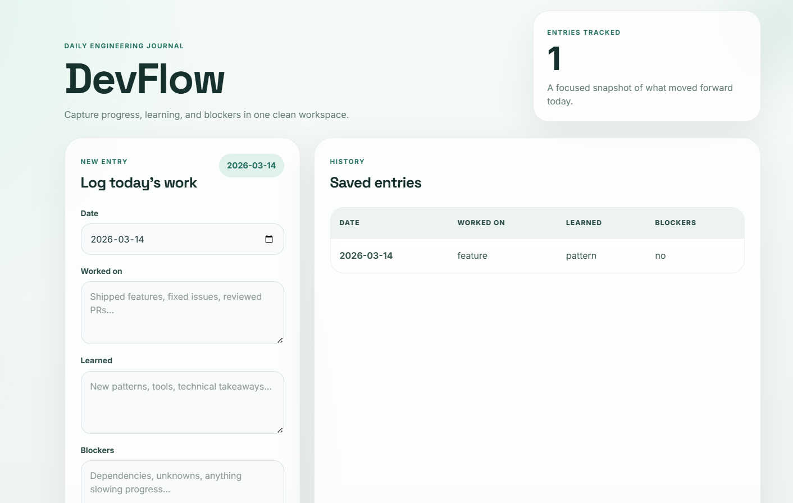
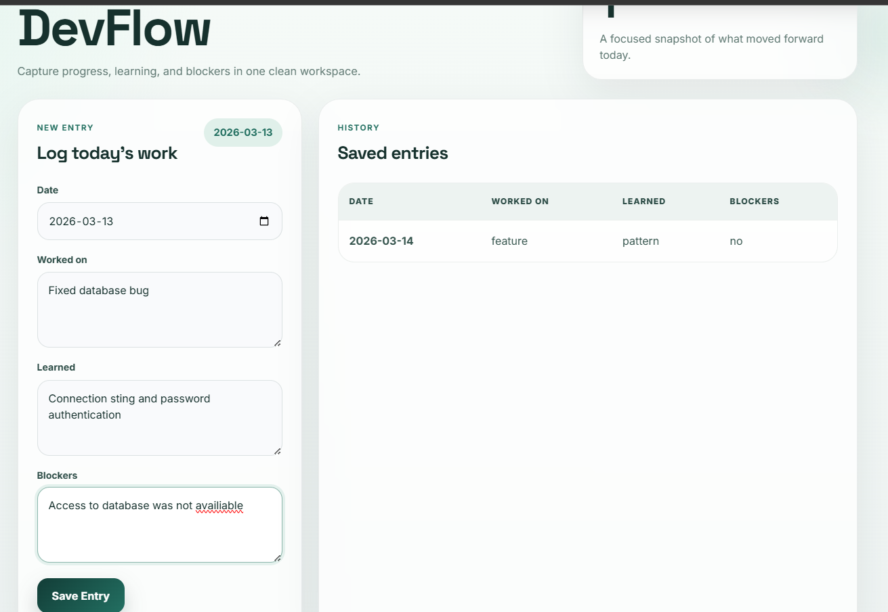
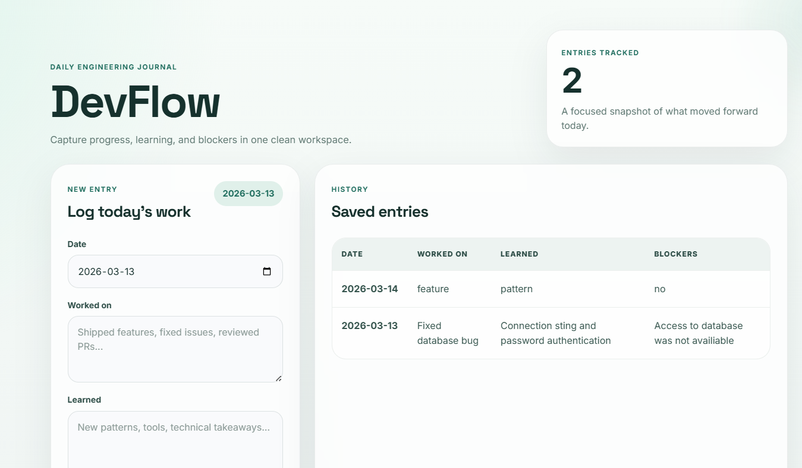

# DevFlow — Full-Stack Developer Journal

DevFlow is a full-stack web application that lets developers keep a simple daily journal of their work. After registering and logging in, users can log what they worked on, what they learned, and what blocked them for any given day. All entries are stored in MongoDB and are private to each user.

**Live demo:** [dev-flow-rashi-dev.vercel.app](https://dev-flow-rashi-dev.vercel.app/)  
**Backend API:** [devflow-rashi-dev.onrender.com](https://devflow-rashi-dev.onrender.com/)  
**Source code:** [github.com/rashir5/DevFlow-Rashi-dev](https://github.com/rashir5/DevFlow-Rashi-dev)

---

## Table of Contents

- [Features](#features)
- [Tech Stack](#tech-stack)
- [Architecture](#architecture)
- [Authentication Flow](#authentication-flow)
- [Journal Entry Flow](#journal-entry-flow)
- [Project Structure](#project-structure)
- [API Endpoints](#api-endpoints)
- [Environment Variables](#environment-variables)
- [Local Setup](#local-setup)
- [Deployment](#deployment)
- [Security](#security)
- [Verified Functionality](#verified-functionality)
- [Screenshots](#screenshots)
- [Future Improvements](#future-improvements)
- [Learning Outcomes](#learning-outcomes)
- [Author](#author)

---

## Features

**User authentication**
- Register with name, email, and password
- Login with email and password
- JWT issued on registration and login, valid for 7 days
- Authentication state persisted in `localStorage` — survives page refresh
- Logout clears the stored token and returns to the login screen
- All `/entries` routes are protected — unauthenticated requests are rejected with HTTP 401

**Developer journaling**
- Create or update a daily journal entry for any date
- Each entry captures: date, what you worked on, what you learned, and any blockers
- Saving an entry for the same date updates the existing record (upsert)
- Entries are displayed in reverse chronological order in a history table
- Live count of total entries tracked shown on the dashboard

**User data isolation**
- Every entry is linked to the authenticated user's ID in MongoDB
- `GET /entries` returns only entries that belong to the logged-in user
- Users cannot see or modify each other's journal entries

**UI**
- Light and dark theme toggle, preference saved to `localStorage`
- Responsive layout that works on desktop and mobile
- Inline loading states and error messages on all async operations
- Greeting shows the logged-in user's name on the dashboard

---

## Tech Stack

| Layer | Technology |
|---|---|
| Frontend | React 19, Vite 7, plain CSS |
| Backend | Node.js, Express 5 |
| Database | MongoDB (Atlas), Mongoose 8 |
| Authentication | JSON Web Tokens (`jsonwebtoken`), `bcryptjs` |
| Input validation | `validator` |
| Dev tooling | nodemon, ESLint |
| Deployment | Vercel (frontend), Render (backend) |

> No frontend routing library is used. Page transitions between Login, Register, and Dashboard are managed with a single `useState` value in `App.jsx`.

---

## Architecture

```
User (browser)
      │
      ▼
React + Vite frontend
  ├── Login / Register pages  →  POST /auth/register  /  POST /auth/login
  └── Dashboard               →  GET /entries  /  POST /entries
            │
            │  HTTP + Authorization: Bearer <JWT>
            ▼
  Express.js REST API  (Node.js)
            │
            ▼
  requireAuth middleware
    └── jwt.verify(token, JWT_SECRET)
    └── attaches req.userId
            │
            ▼
  Mongoose models
    ├── User   (name, email, passwordHash)
    └── Entry  (userId, date, workedOn, learned, blockers, …)
            │
            ▼
  MongoDB Atlas
```

---

## Authentication Flow

### Registration

1. User fills in name, email, and password on the Register page.
2. Frontend `POST /auth/register` with `{ name, email, password }`.
3. Backend validates the inputs and checks the email format using `validator`.
4. Password is hashed with `bcryptjs` (10 salt rounds).
5. A new `User` document is created in MongoDB.
6. A JWT signed with `JWT_SECRET` (7-day expiry) is returned along with `{ id, name, email }`.
7. Frontend stores the token and user object in `localStorage` under the keys `devflow-token` and `devflow-user`.
8. The app transitions directly to the Dashboard.

### Login

1. User fills in email and password on the Login page.
2. Frontend `POST /auth/login` with `{ email, password }`.
3. Backend looks up the user by email and compares the password against the stored hash with `bcryptjs.compare`.
4. A new JWT is signed and returned with the same user object.
5. Frontend stores them in `localStorage` and transitions to the Dashboard.

### Session persistence

On every page load, `AuthContext` reads `devflow-token` and `devflow-user` from `localStorage`. If both exist, the user is treated as authenticated without a round-trip to the server.

### Logout

Clicking **Logout** removes both `localStorage` keys and resets auth state to `null`, returning to the Login page.

### Token verification (backend)

Every request to `/entries` passes through `requireAuth` middleware:

```
Authorization: Bearer <JWT_TOKEN>
```

The middleware extracts the token, calls `jwt.verify()`, and attaches `payload.userId` to `req.userId`. If the token is missing, malformed, or expired, the request is rejected with HTTP 401.

---

## Journal Entry Flow

### Creating / updating an entry

1. User fills in the entry form on the Dashboard (date defaults to today).
2. On submit, `POST /entries` is called with `Authorization: Bearer <token>` in the header.
3. The `requireAuth` middleware verifies the JWT and sets `req.userId`.
4. The route does a Mongoose `findOneAndUpdate` with `{ userId: req.userId, date }` as the filter.  
   If an entry for that `(userId, date)` pair exists it is updated; otherwise a new document is inserted (upsert).
5. The saved entry is returned and the history table is refreshed.

### Retrieving entries

1. On Dashboard load, `GET /entries` is called with the auth header.
2. The backend queries `Entry.find({ userId: req.userId })` — only that user's entries are returned, sorted newest first.
3. The `EntryTable` component renders them in the history panel.

---

## Project Structure

```
DevFlow-Rashi-dev/
├── client/
│   ├── public/
│   │   └── vite.svg
│   ├── src/
│   │   ├── components/
│   │   │   ├── EntryForm.jsx        # Entry creation form
│   │   │   └── EntryTable.jsx       # Entry history table
│   │   ├── context/
│   │   │   └── AuthContext.jsx      # JWT auth state + localStorage persistence
│   │   ├── pages/
│   │   │   ├── Dashboard.jsx        # Main journal view (protected)
│   │   │   ├── Login.jsx            # Login page
│   │   │   └── Register.jsx         # Registration page
│   │   ├── App.css                  # All component and page styles
│   │   ├── App.jsx                  # Auth-based routing (no router library)
│   │   ├── index.css                # CSS variables, theme tokens, global resets
│   │   └── main.jsx                 # React entry point
│   ├── index.html
│   ├── vite.config.js
│   └── package.json
│
├── server/
│   ├── controllers/
│   │   └── authController.js        # register / login logic
│   ├── middleware/
│   │   └── auth.js                  # JWT verification middleware
│   ├── models/
│   │   ├── Entry.js                 # Mongoose Entry schema
│   │   └── User.js                  # Mongoose User schema
│   ├── routes/
│   │   ├── authRoutes.js            # POST /auth/register, POST /auth/login
│   │   └── entryRoutes.js           # GET /entries, POST /entries (protected)
│   ├── server.js                    # Express app, CORS, DB connection
│   └── package.json
│
├── screenshots/
│   ├── img1.png
│   ├── img2.png
│   └── img3.png
│
├── .gitignore
└── README.md
```

---

## API Endpoints

All requests and responses use JSON.

### Health check

| Method | Endpoint | Auth required | Description |
|--------|----------|---------------|-------------|
| GET | `/` | No | Returns `{ message: "DevFlow API running 🚀" }` |

### Authentication

| Method | Endpoint | Auth required | Description |
|--------|----------|---------------|-------------|
| POST | `/auth/register` | No | Create a new user account |
| POST | `/auth/login` | No | Log in and receive a JWT |

**POST `/auth/register`** request body:
```json
{
  "name": "Rashi Wahane",
  "email": "rashi@example.com",
  "password": "yourpassword"
}
```

**POST `/auth/login`** request body:
```json
{
  "email": "rashi@example.com",
  "password": "yourpassword"
}
```

Both return on success:
```json
{
  "token": "<JWT>",
  "user": { "id": "...", "name": "Rashi Wahane", "email": "rashi@example.com" }
}
```

### Journal entries

Both routes require `Authorization: Bearer <JWT>` in the request header.

| Method | Endpoint | Auth required | Description |
|--------|----------|---------------|-------------|
| GET | `/entries` | Yes | Return all entries for the authenticated user, newest first |
| POST | `/entries` | Yes | Create or update the entry for a given date |

**POST `/entries`** request body:
```json
{
  "date": "2026-09-27",
  "workedOn": "Built the authentication flow",
  "learned": "JWT expiry and compound MongoDB indexes",
  "blockers": "Stale unique index caused save failures"
}
```

> There are no `PUT /entries/:id` or `DELETE /entries/:id` endpoints. Editing is done by re-submitting `POST /entries` with the same date.

---

## Environment Variables

### Server (`server/.env`)

```env
MONGO_URI=your_mongodb_atlas_connection_string
JWT_SECRET=your_jwt_secret_key
PORT=5000
```

### Client (`client/.env`)

```env
VITE_API_URL=http://localhost:5000
```

> **Never commit `.env` files.** Both `.gitignore` files exclude all `.env` and `.env.*` files from version control.

---

## Local Setup

**Prerequisites:** Node.js (v18+), npm, a MongoDB Atlas cluster (or local MongoDB).

### 1. Clone the repository

```bash
git clone https://github.com/rashir5/DevFlow-Rashi-dev.git
cd DevFlow-Rashi-dev
```

### 2. Set up the backend

```bash
cd server
npm install
```

Create `server/.env`:

```env
MONGO_URI=your_mongodb_connection_string
JWT_SECRET=a_strong_random_secret
PORT=5000
```

Start the backend:

```bash
npm run dev        # development (nodemon, auto-restarts)
# or
npm start          # production (node)
```

### 3. Set up the frontend

Open a new terminal:

```bash
cd client
npm install
```

Create `client/.env`:

```env
VITE_API_URL=http://localhost:5000
```

Start the frontend:

```bash
npm run dev
```

### 4. Open in browser

```
http://localhost:5173
```

---

## Deployment

| Layer | Platform | Notes |
|---|---|---|
| Frontend | [Vercel](https://vercel.com) | Auto-deploys from the `client/` folder on push to main; set `VITE_API_URL` to the Render backend URL in Vercel project settings |
| Backend | [Render](https://render.com) | Runs `node server.js`; set `MONGO_URI`, `JWT_SECRET`, and `PORT` in Render environment variables |
| Database | [MongoDB Atlas](https://www.mongodb.com/atlas) | Free-tier cluster; whitelist Render's outbound IPs or use `0.0.0.0/0` for development |

**Live URLs:**
- Frontend: https://dev-flow-rashi-dev.vercel.app/
- Backend: https://devflow-rashi-dev.onrender.com/

---

## Security

| Mechanism | Implementation |
|---|---|
| Password hashing | `bcryptjs.hash(password, 10)` — passwords are never stored in plain text |
| JWT authentication | Tokens signed with `JWT_SECRET`, expire after 7 days |
| Protected routes | `requireAuth` middleware blocks all `/entries` requests without a valid token |
| User data isolation | Every DB query on `/entries` is scoped to `req.userId` — users cannot access each other's data |
| Auth header only | Token is sent via `Authorization: Bearer` header, not cookies or query strings |
| CORS | Only `localhost` origins and `.vercel.app` domains are permitted; controlled by `cors` middleware |
| Secrets in env | `MONGO_URI` and `JWT_SECRET` are loaded from `.env` files excluded from Git |

---

## Verified Functionality

The following was tested locally with the frontend at `http://localhost:5173` and the backend at `http://localhost:5000`:

- [x] User registration (name, email, password)
- [x] Login with valid credentials
- [x] JWT stored in `localStorage` and persists on page refresh
- [x] Dashboard loads after login without re-authenticating
- [x] Create a new journal entry
- [x] Save entry — stored in MongoDB
- [x] Re-saving on the same date updates the existing entry
- [x] Entry history table refreshes after save
- [x] Entries persist after a full page refresh
- [x] Each user sees only their own entries
- [x] Logout clears session and returns to Login
- [x] Protected routes return HTTP 401 without a valid token
- [x] Frontend production build completes without errors (`vite build`)
- [x] MongoDB Atlas connection works

> No automated test suite is included. All verification was done manually.

---

## Screenshots

### Dashboard — light theme



### Filling in a journal entry



### Dashboard with saved entries



---

## Future Improvements

- Edit or delete individual journal entries
- Search and filter entries by keyword or date range
- Entry tags and categories
- Markdown or rich text support for entry fields
- Analytics view (streak tracking, entry frequency)
- Export entries to CSV or PDF
- Automated tests (unit and integration)

---

## Learning Outcomes

This project covers end-to-end full-stack development:

- **React** — component composition, hooks (`useState`, `useEffect`, `useContext`), React Context API for shared auth state
- **Vite** — project setup, environment variable handling (`import.meta.env`)
- **Node.js + Express** — REST API design, middleware, async route handlers
- **JWT authentication** — token generation, verification, and client-side persistence
- **bcryptjs** — secure password hashing
- **MongoDB + Mongoose** — schema design, compound unique indexes, upsert with `$set`
- **CORS** — configuring cross-origin access for production deployments
- **Debugging** — tracing a live production bug (stale MongoDB index) to its root cause and fixing it without breaking existing data
- **Deployment** — connecting Vercel (frontend), Render (backend), and MongoDB Atlas

---

## Author

**Rashi Wahane**  
Computer Science and Engineering  
Bharatiya Vidya Bhavan's Sardar Patel Institute of Technology, Mumbai

- GitHub: [github.com/rashir5](https://github.com/rashir5)
- LinkedIn: [linkedin.com/in/rashi-wahane](https://www.linkedin.com/in/rashi-wahane)
- Project: [github.com/rashir5/DevFlow-Rashi-dev](https://github.com/rashir5/DevFlow-Rashi-dev)
